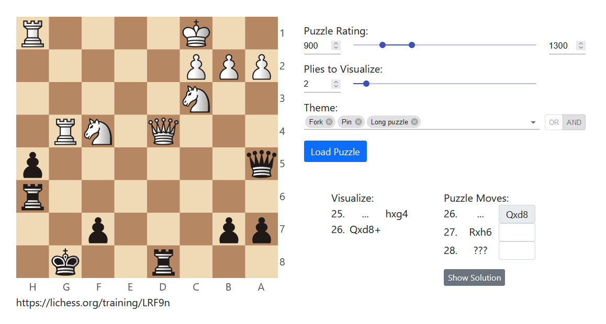

# chess-visualization
A web app for practicing chess visualization.



## Setup

```bash
git clone https://github.com/josephcappadona/chess-visualization.git
cd chess-visualization
python3.8 -m venv venv
source venv/bin/activate
pip install -r requirements.txt
npm install
npm run dev
```